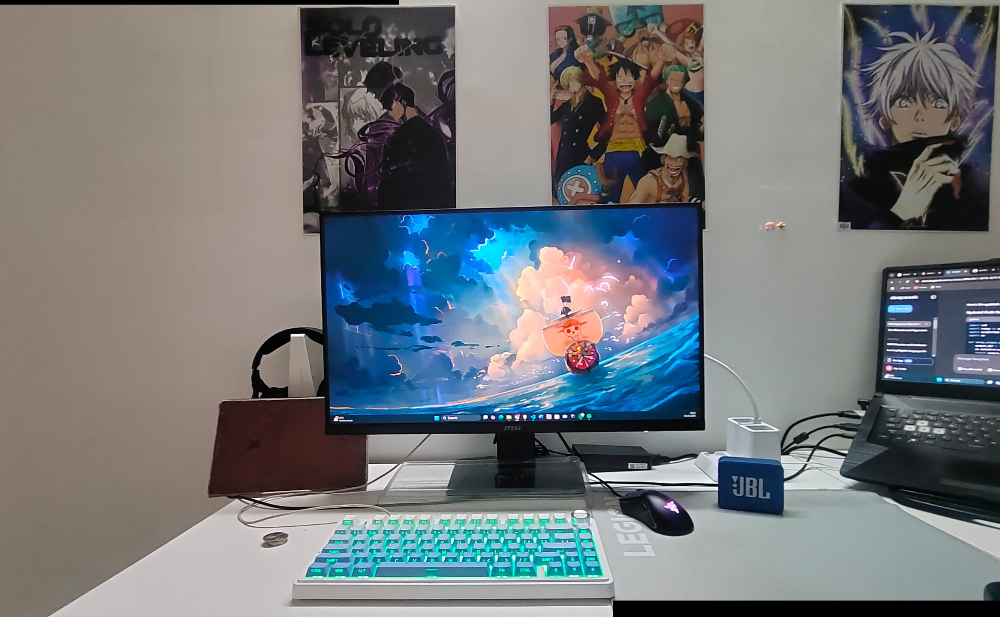

# Coin Detection and Panorama Stitching
`q1.py` - Coin Detection & Counting  
`q2.py` - Panorama Stitching

## Folder Structure  
```
VR_Assignment1_Harshith_IMT2022023/
├── input_images/
│   ├── coins.jpg
│   ├── panorama_left.jpg
│   └── panorama_right.jpg
├── output_images/
│   ├── canny_edges.jpg
│   ├── contours_detected.jpg
│   ├── segmented_coins.jpg
│   ├── keypoints_1.jpg
│   ├── keypoints_2.jpg
│   └── panorama_output.jpg
├── q1.py
├── q2.py
└── README.md
```

## Requirements
```bash
pip install opencv-python-headless numpy matplotlib
```

## Part 1: Coin Detection & Counting (q1.py)
### Methodology & Explanation
This implementation detects and counts coins in an image using:
1. Adaptive thresholding and morphological operations
2. Canny edge detection with post-processing
3. Contour analysis with circularity filtering
4. Color segmentation for individual coins

### How to Run  
1. Place input image in `input_images/coins.jpg`  
2. Execute:  
```bash
python q1.py
```

### Results & Visualizations 

#### Original Input Image


#### Canny Edge Detection


#### Isolated Coin Boundaries


#### Detected Coin Contours


#### Color-coded Segmentation


## Part 2: Panorama Stitching (q2.py)
### Methodology & Explanation
This implementation stitches images using:
1. SIFT feature detection
2. BFMatcher with Lowe's ratio test
3. RANSAC for homography estimation
4. Perspective warping and blending

### How to Run  
1. Place images in `input_images/` as:  
   - `panorama_left.jpg`  
   - `panorama_right.jpg`  
2. Execute:  
```bash
python q2.py
```

### Results & Visualizations

#### Left Image Keypoints


#### Right Image Keypoints


#### Final Stitched Panorama


## Key Algorithms
| Component          | Techniques Used                     |
|--------------------|-------------------------------------|
| Coin Detection     | Adaptive Thresholding, Morphological Ops, Contour Analysis |
| Feature Matching   | SIFT, BFMatcher, Lowe's Ratio Test  |
| Image Alignment    | RANSAC, Homography Estimation       |
| Blending           | Perspective Warping, Mask Blending  |

## Workflow Overview

**Part 1 Workflow:**  
Input → Grayscale Conversion → Edge Detection → Contour Filtering → Segmentation → Counting

**Part 2 Workflow:**  
Image Pair → Feature Detection → Feature Matching → Homography Estimation → Warping → Blending → Panorama

## Results & Observations  

### Coin Detection Results
- Detected 5 coins in sample image
- Preserved circular boundaries through edge detection
- Removed artifacts using morphological operations

### Panorama Stitching Results
- Detected 5000+ SIFT keypoints per image
- Achieved seamless transition through RANSAC
- Maintained image continuity in final panorama
```
